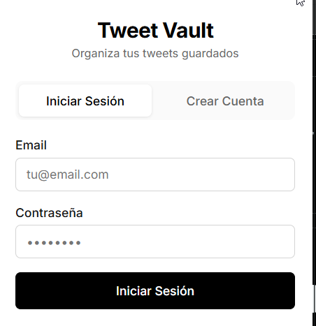
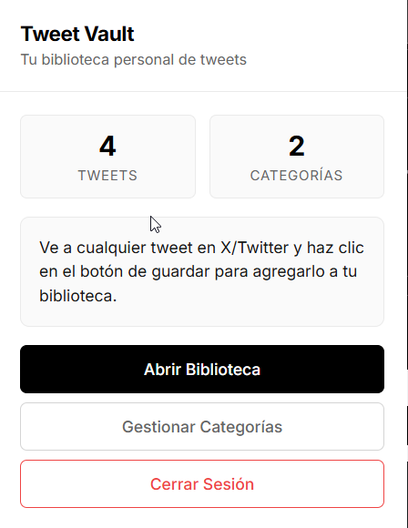
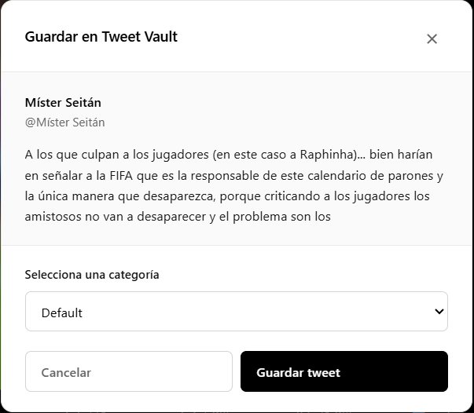
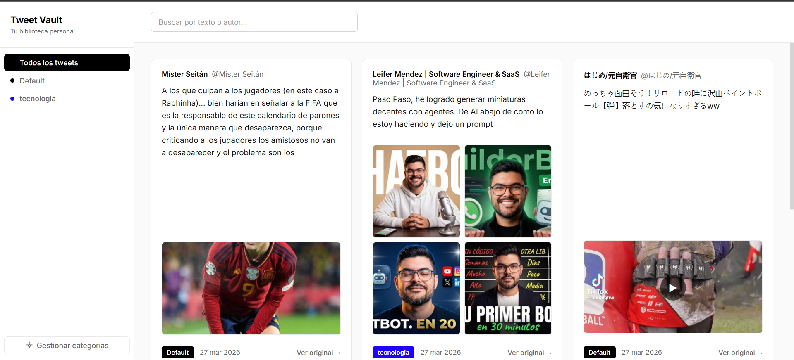
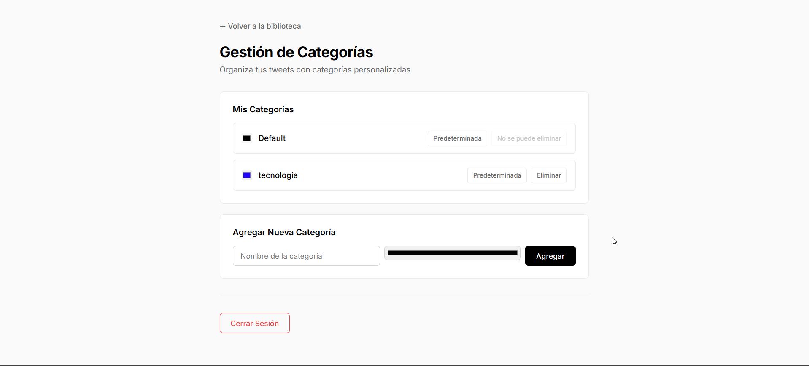

# Tweet Vault

Extensión de Chrome para guardar y organizar tweets de X/Twitter por categorías.


## Descripción

Tweet Vault resuelve un problema específico: X/Twitter Premium no permite organizar los tweets guardados por categorías. Esta extensión añade un paso de categorización al guardar tweets sin interrumpir el flujo natural de navegación.

## Características

- **Guardar tweets** con un click desde cualquier tweet en X/Twitter
- **Categorización automática** - selecciona categoría al guardar
- **Categorías predefinidas**: Ideas/Inspiración, Recursos/Herramientas, Noticias/Tendencias, Humor/Entretenimiento
- **Categorías personalizadas** - crea las tuyas propias
- **Búsqueda** - busca por texto o autor
- **Gestión de medios** - guarda imágenes adjuntas a tweets
- **Sincronización en la nube** - tus datos guardados en Supabase
- **Acceso multi-dispositivo** - inicia sesión en cualquier navegador

## Requisitos

- Google Chrome 120+ o navegador basado en Chromium (Edge, Brave)
- Cuenta de Supabase (gratuita)

## Instalación

### 1. Clonar el repositorio

```bash
git clone <url-del-repo>
cd tweet-vault-extension
```

### 2. Configurar credenciales de Supabase

Copia el archivo de configuración de ejemplo:

```bash
cp src/config/config.example.js src/config/config.js
```

Edita `src/config/config.js` y pon tus credenciales de Supabase:

```javascript
export const SUPABASE_URL = 'https://tu-proyecto.supabase.co';
export const SUPABASE_ANON_KEY = 'tu-clave-publica-anon';
```

> **Nota:** `config.js` contiene tus credenciales y está en `.gitignore`, así que no se subirá al repositorio.

### 3. Configurar Supabase

#### Crear tablas

En el SQL Editor de Supabase, ejecuta:

```sql
-- Tabla de categorías
CREATE TABLE categories (
  id UUID PRIMARY KEY DEFAULT gen_random_uuid(),
  user_id UUID REFERENCES auth.users(id) ON DELETE CASCADE,
  name TEXT NOT NULL,
  color TEXT NOT NULL DEFAULT '#000000',
  is_default BOOLEAN DEFAULT FALSE,
  created_at TIMESTAMP WITH TIME ZONE DEFAULT NOW()
);

-- Tabla de tweets guardados
CREATE TABLE tweets (
  id UUID PRIMARY KEY DEFAULT gen_random_uuid(),
  user_id UUID REFERENCES auth.users(id) ON DELETE CASCADE,
  tweet_id TEXT NOT NULL,
  url TEXT NOT NULL,
  text TEXT,
  author TEXT,
  handle TEXT,
  published_at TIMESTAMP WITH TIME ZONE,
  saved_at TIMESTAMP WITH TIME ZONE DEFAULT NOW(),
  category_id UUID REFERENCES categories(id) ON DELETE SET NULL,
  images jsonb,
  UNIQUE(user_id, tweet_id)
);

-- Índices
CREATE INDEX idx_tweets_user_id ON tweets(user_id);
CREATE INDEX idx_tweets_category_id ON tweets(category_id);
CREATE INDEX idx_categories_user_id ON categories(user_id);

-- Habilitar RLS
ALTER TABLE categories ENABLE ROW LEVEL SECURITY;
ALTER TABLE tweets ENABLE ROW LEVEL SECURITY;

-- Políticas para categorías
CREATE POLICY "Users can view own categories" ON categories
  FOR SELECT USING (auth.uid() = user_id);

CREATE POLICY "Users can insert own categories" ON categories
  FOR INSERT WITH CHECK (auth.uid() = user_id);

CREATE POLICY "Users can update own categories" ON categories
  FOR UPDATE USING (auth.uid() = user_id);

CREATE POLICY "Users can delete own categories" ON categories
  FOR DELETE USING (auth.uid() = user_id);

-- Políticas para tweets
CREATE POLICY "Users can view own tweets" ON tweets
  FOR SELECT USING (auth.uid() = user_id);

CREATE POLICY "Users can insert own tweets" ON tweets
  FOR INSERT WITH CHECK (auth.uid() = user_id);

CREATE POLICY "Users can update own tweets" ON tweets
  FOR UPDATE USING (auth.uid() = user_id);

CREATE POLICY "Users can delete own tweets" ON tweets
  FOR DELETE USING (auth.uid() = user_id);
```

#### Habilitar autenticación por email

1. Ve a **Authentication** > **Providers**
2. Asegúrate de que **Email** esté habilitado

### 4. Cargar la extensión en Chrome

1. Abre `chrome://extensions/`
2. Activa **Modo desarrollador** (toggle en la esquina superior derecha)
3. Click en **Cargar sin empaquetar**
4. Selecciona la carpeta `src` del proyecto

## Uso

### Guardar un tweet

1. Navega a un tweet en x.com
2. Haz click en el botón de **Bookmark** (guardar) de Twitter
3. El tweet se guarda en Twitter y aparece el modal de Tweet Vault
4. Selecciona una categoría y haz click en **Guardar**

### Consultar guardados

1. Click en el icono de Tweet Vault en la barra del navegador
2. Verás tu biblioteca con todos los tweets guardados
3. Filtra por categoría o busca por texto/autor

### Gestionar categorías

1. Click en **Gestionar Categorías** en el popup
2. Crea, edita o elimina categorías
3. Establece una categoría por defecto

## Screenshots

### Popup - Login


### Popup - Home


### Modal de guardado


### Biblioteca


### Gestión de categorías


## Estructura del proyecto

```
tweet-vault-extension/
├── src/
│   ├── auth/           # Pantalla de login/registro
│   ├── background/     # Service worker (comunicación con Supabase)
│   ├── config/         # Configuración de Supabase
│   ├── content/        # Content script (interactúa con Twitter)
│   ├── library/        # Página de biblioteca
│   ├── popup/          # Popup principal
│   ├── settings/       # Página de gestión de categorías
│   └── icons/          # Iconos de la extensión
├── screenshots/        # Imágenes para documentación
├── manifest.json       # Configuración de la extensión
├── .gitignore          # Archivos ignorados por git
└── README.md           # Este archivo
```

## Tecnologías

- **Chrome Extensions API** - Manifest V3
- **Supabase** - Base de datos y autenticación
- **JavaScript vanilla** - Sin frameworks

##Limitaciones conocidas

- Los videos de Twitter usan URLs temporales (`blob:`), por lo que solo se guarda el thumbnail/preview
- La extracción de medios depende de la estructura del DOM de X/Twitter, que puede cambiar

## Licencia

MIT
